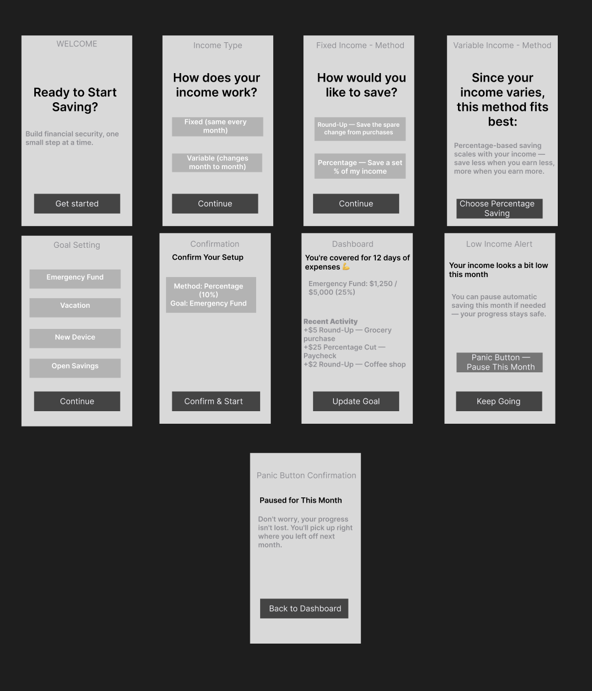

# Savings App — Product Discovery & UX Research Case Study

🇹🇷 [Bu sayfanın Türkçe versiyonu için tıklayın](README.tr.md)



## About This Project

This is a solo product discovery and UX research project created for
portfolio purposes, simulating an end-to-end product management process:
from raw user insight to a tested, iterated product concept.

**Note:** This is a simulated / practice case study. Interviews and
usability tests are constructed based on realistic behavioral patterns
and secondary research on youth financial behavior, not live field
research. This is disclosed transparently throughout.

**Role:** Product Manager / UX Researcher (solo)
**Focus areas:** Product discovery, user research, JTBD, persona
development, journey mapping, ideation, low-fidelity design, usability testing

---

## The Problem

Young people (18-27) want to save money for financial security, but
existing financial tools feel complex, fail to build trust, and don't
adapt to different income patterns — whether fixed or irregular. As a
result, saving behavior either never starts or isn't sustained.

---

## Process

```
Interview → Raw Insights → Affinity Mapping → Pain Points → JTBD →
Persona → Customer Journey Map → Problem Statement → How Might We →
Ideation → User Flow → Wireframe → Usability Test → Iteration
```

---

## 1. Research: Simulated Interviews

17 raw insights were synthesized across four realistic user profiles:

1. **Recent graduate** (fixed income)
2. **University student** (part-time, low/irregular income)
3. **Early-career employee** (1-2 years, mid income)
4. **Freelancer / gig worker** (highly irregular income)

Sample insight: *"Some months I earn a lot, some months nothing, picking
a fixed day makes no sense for me."* (Freelancer, on why fixed saving
dates don't work)

Full raw insights: [`01-research/raw-insights.md`](01-research/raw-insights.md)

### Affinity Mapping → 6 Core Pain Points

| # | Pain Point | Description |
|---|---|---|
| 1 | **Lack of Visibility** | Users don't know where their money goes |
| 2 | **Trust / Complexity** | Financial products feel risky and confusing |
| 3 | **Perceived Meaninglessness** | Small amounts feel not worth saving |
| 4 | **Unsustainability** | Saving habits break at the first setback |
| 5 | **Irregular Income Mismatch** | Fixed systems don't work for variable income |
| 6 | **Goal Ambiguity** | No concrete reason to save, motivation fades |

Full mapping: [`01-research/affinity-mapping.md`](01-research/affinity-mapping.md)

---

## 2. Jobs To Be Done (JTBD)

Each pain point was reframed as a job the user is trying to accomplish:

> **JTBD 5 — Irregular Income:** "When my income changes month to month,
> I want a flexible saving method, so I don't feel excluded by systems
> built for fixed salaries."

> **JTBD 4 — Sustainability:** "When I try to build a saving habit, I
> want a system that survives setbacks, so my earlier effort isn't wasted."

Full JTBD list: [`01-research/jtbd.md`](01-research/jtbd.md)

---

## 3. Personas

Two personas represent the two most distinct behavioral patterns found
in research — differentiated by income structure, not demographics:

| | **Mert Yıldız** | **Ece Demir** |
|---|---|---|
| Age | 24 | 26 |
| Status | Recent graduate, first job | Freelance designer |
| Income | Fixed monthly salary | Highly variable |
| Core barrier | Complexity, procrastination | Fixed systems don't fit variable income |
| Core need | Visibility + trust | Flexibility + a buffer against uncertainty |
| Quote | *"I know I should be saving, but I never learned where to start — my bank's app feels way too technical."* | *"Some months I earn a lot, some months nothing — setting a fixed date just doesn't make sense for me."* |

Full personas: [`02-personas/persona-mert.md`](02-personas/persona-mert.md) · [`02-personas/persona-ece.md`](02-personas/persona-ece.md)

---

## 4. Customer Journey Maps — Moment of Truth

Mapping each persona's emotional journey revealed a critical decision point:

- **Mert's Moment of Truth:** Opening the investment/fund tab mid-month
  — this is where he either tries or gives up, due to overwhelming
  financial jargon.
- **Ece's Moment of Truth:** Realizing, during a low-income month, that
  she has no financial buffer — panic and regret peak here.

These two moments became the anchor points for the entire product concept.

Full journey maps: [`03-journey-maps/journey-map-mert.md`](03-journey-maps/journey-map-mert.md) · [`03-journey-maps/journey-map-ece.md`](03-journey-maps/journey-map-ece.md)

---

## 5. Problem Statement & How Might We

**Problem Statement:**
> Young individuals aged 18-27 — regardless of whether their income is
> stable or irregular — want to build savings for financial security.
> However, existing financial tools are complex, fail to build trust,
> and don't adapt to different income patterns. This results in savings
> behavior that either never starts or isn't sustained.

**Key HMWs that shaped the solution:**
- *HMW help users see where their money goes instantly, without complex analysis?* (Mert)
- *HMW create an automatic but income-sensitive saving mechanism?* (Ece)
- *HMW reduce the panic users feel during low-income months?* (Ece)

Full HMWs: [`04-problem-definition/how-might-we.md`](04-problem-definition/how-might-we.md)

---

## 6. Ideation → Selected Concept

Using a Crazy 8s approach, 8 divergent ideas were generated. Rather than
picking one, the strongest concept emerged from combining four:

- **Round-Up saving** — solves perceived meaninglessness of small amounts
- **Income-sensitive percentage saving** — solves irregular income mismatch
- **Visual goal tracking** — solves visibility + goal ambiguity
- **"Panic Button"** — solves unsustainability during setbacks

Full ideation log: [`05-ideation/crazy-8-ideas.md`](05-ideation/crazy-8-ideas.md)

---

## 7. User Flow & Wireframes

An 8-screen user flow branches at the income-type decision and converges
at a shared dashboard:

```
Welcome → Income Type → [Fixed: Method A | Variable: Method B] →
Goal Setting → Confirmation → Dashboard → (Low Income Alert →
Panic Button → back to Dashboard)
```

Full user flow: [`06-user-flow/user-flow.md`](06-user-flow/user-flow.md)

### Figma Prototype
[View on Figma → ](07-wireframes/figma/figma-link.md)


### HTML Wireframes (Low-Fidelity)
Bilingual static wireframes (EN/TR), viewable directly in browser:
- [`07-wireframes/html/savings-app-en.html`](07-wireframes/html/savings-app-en.html)
- [`07-wireframes/html/savings-app-tr.html`](07-wireframes/html/savings-app-tr.html)


---

## 8. Usability Testing & Iteration

A simulated usability test with 5 participants (across both personas)
focused on three tasks: setting a goal, understanding the dashboard, and
using the Panic Button.

**Key finding:** The Panic Button — the most novel part of the concept —
was initially missed by some participants because it looked like a
routine notification.

**Iteration:** Increased visual distinctiveness (border, color contrast)
of the Panic Button alert to separate it from routine notifications.

Full findings and before/after: [`08-usability-testing/findings-iteration.md`](08-usability-testing/findings-iteration.md)

---

## Reflection & Learnings

- Framing the problem around **behavior**, not just "people don't save
  enough," led to a more flexible product concept than a typical
  investment app.
- Designing for **two divergent personas** early on prevented a
  one-size-fits-all solution that would have failed a large share of users.
- The most valuable product decision — the Panic Button — came directly
  from a Journey Map "Moment of Truth," reinforcing how research should
  anchor ideation, not just inspire it.

## What I'd Do Differently With Real Users

- Run actual interviews to validate the simulated insights.
- A/B test round-up vs. percentage as the default saving method.
- Explore extending the Panic Button into a broader financial
  resilience feature.

---

## Full Project Structure

| Folder | Contents |
|---|---|
| [`01-research/`](01-research/) | Raw insights, affinity mapping, JTBD |
| [`02-personas/`](02-personas/) | Two personas (fixed vs. irregular income) |
| [`03-journey-maps/`](03-journey-maps/) | Customer journey maps per persona |
| [`04-problem-definition/`](04-problem-definition/) | Problem statement, How Might We |
| [`05-ideation/`](05-ideation/) | Crazy 8s ideation and selected concept |
| [`06-user-flow/`](06-user-flow/) | Text-based user flow (8 screens) |
| [`07-wireframes/`](07-wireframes/) | HTML wireframes + Figma prototype link |
| [`08-usability-testing/`](08-usability-testing/) | Test plan, findings, iteration |
| [`assets/ui/`](assets/ui/) | Screenshots (Figma + HTML wireframes) |
| [`case-study.md`](case-study.md) | Full narrative case study (same content, long-form) |

