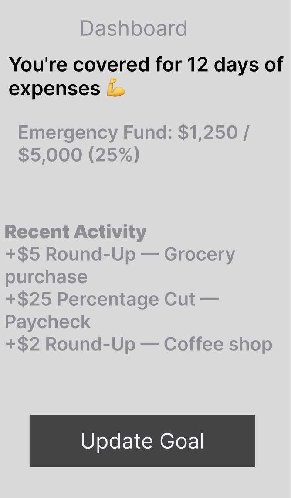
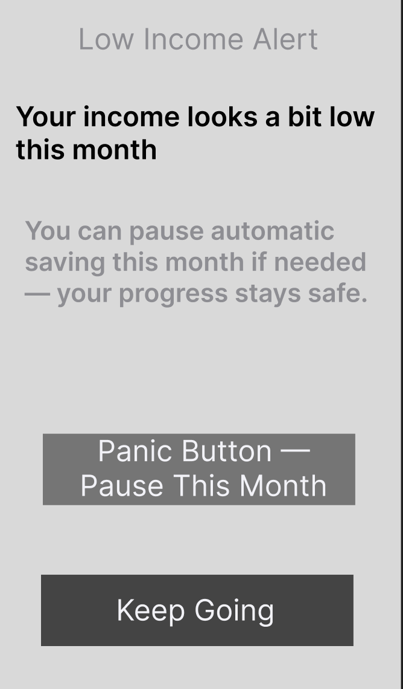

# Savings App — Product Discovery & UX Research Case Study

🇹🇷 [Bu sayfanın Türkçe versiyonu için tıklayın](README.tr.md)

## About This Project

This is a solo product discovery and UX research project created for
portfolio purposes, simulating an end-to-end product management process:
from raw user insight to a tested, iterated product concept.

**Note:** This is a simulated / practice case study. Interviews and
usability tests are constructed based on realistic behavioral patterns
and secondary research on youth financial behavior, not live field
research. This is disclosed transparently throughout.

**Role:** Product Manager / UX Researcher (solo)
**Focus areas:** Product discovery, user research, JTBD, persona
development, journey mapping, ideation, low-fidelity design, usability testing

---

## The Problem

Young people (18-27) want to save money for financial security, but
existing financial tools feel complex, fail to build trust, and don't
adapt to different income patterns — whether fixed or irregular. As a
result, saving behavior either never starts or isn't sustained.

Full write-up: [`case-study.md`](case-study.md)

---

## Process
Interview → Raw Insights → Affinity Mapping → Pain Points → JTBD →
Persona → Customer Journey Map → Problem Statement → How Might We →
Ideation → User Flow → Wireframe → Usability Test → Iteration

## Project Structure

| Folder | Contents |
|---|---|
| [`01-research/`](01-research/) | Raw insights, affinity mapping, JTBD |
| [`02-personas/`](02-personas/) | Two personas (fixed vs. irregular income) |
| [`03-journey-maps/`](03-journey-maps/) | Customer journey maps per persona |
| [`04-problem-definition/`](04-problem-definition/) | Problem statement, How Might We |
| [`05-ideation/`](05-ideation/) | Crazy 8s ideation and selected concept |
| [`06-user-flow/`](06-user-flow/) | Text-based user flow (8 screens) |
| [`07-wireframes/`](07-wireframes/) | HTML wireframes + Figma prototype link |
| [`08-usability-testing/`](08-usability-testing/) | Test plan, findings, iteration |
| [`assets/ui/`](assets/ui/) | Screenshots (Figma + HTML wireframes) |
| [`case-study.md`](case-study.md) | Full narrative case study |

---

## Key Insight → Solution Summary

Research surfaced two distinct user segments with conflicting needs:

- **Fixed-income users** struggle with visibility and trust in financial products.
- **Irregular-income users** are underserved by fixed-date, fixed-amount saving systems.

The resulting concept combines **Round-Up saving**, **income-sensitive
percentage saving**, **visual progress tracking**, and a **"Panic
Button"** to pause saving without penalty during low-income months.

---

## Wireframes

### Figma Prototype
[View on Figma → ](07-wireframes/figma/figma-link.md)

### HTML Wireframes (Low-Fidelity)
Bilingual static wireframes (EN/TR), viewable directly in browser:
- [`07-wireframes/html/savings-app-en.html`](07-wireframes/html/savings-app-en.html)
- [`07-wireframes/html/savings-app-tr.html`](07-wireframes/html/savings-app-tr.html)

---

## Usability Testing Highlight

A simulated usability test revealed that the **Panic Button** — the most
novel feature — was initially missed by some participants because it
looked like a routine notification. This was iterated on by increasing
its visual distinctiveness.

Full findings: [`08-usability-testing/findings-iteration.md`](08-usability-testing/findings-iteration.md)

---

## What I'd Do Differently With Real Users

- Run actual interviews to validate the simulated insights.
- A/B test round-up vs. percentage as the default saving method.
- Explore extending the Panic Button into a broader financial
  resilience feature.

---

## Read the Full Case Study

👉 [`case-study.md`](case-study.md) — the complete narrative, from
problem to solution to reflection.

---
